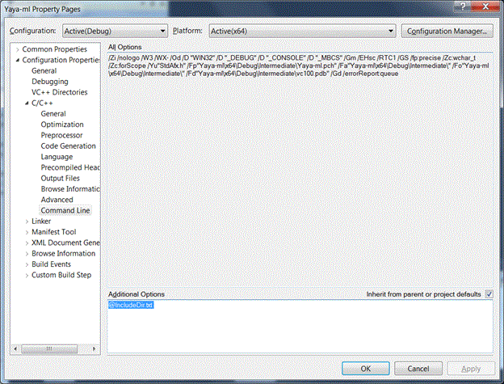
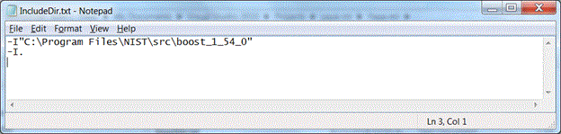

# Readme C++ YaYa-ml "Lite"
 
----

YaYaMlReadme.docx

This github site contains a relatively simple (a least number of files-wise) implementation of YAML. Features are sparse:
 - "Reentrant" Boost Spirit Classic parser  - the implementation alone is interesting.
 - Suitable for reading MTConnect Yaml.  This was its intended purpose. Wanted to use existing library but they morphed into behemoths – albeit with standard compliance, better coding and better testing.
 - This repository includes the YamlReader header/source but you will need to supply a reference to Boost library location so the include files for Boost Spirit Classic can be loaded.
 - A Spirit parser exists and parses into a tree that is accessed by a "dot-delimited" accessor:  e.g., Root.Branch1.BranchN.Leaf
To simplify understanding only a Debug x64 bit implementation in Visual C++ 2010 is used. So, it is a C98 compliant implementation. 
Note there is hard coding in the test solution to allow lookup of the Boost headers.  It requires a two step operation. What is done for you is the configuration within Visual Studio:

Second WHAT YOU MUST DO is modify the IncludeDir.txt file to point to your location of the boost implementation. It is beyond the scope of this document to explain how to build a boost library on Windows.  Boost version 1.54 was used but any version should suffice. 


## YAML
Did not read the Yaml specification. Error checking is minimal. This is what I hoped to parse:

	AllowPut=true
	CheckpointFrequency=10000
	Devices=Devices.xml
	Port=5000
	ServiceName=MTConnectAgent
	logger_config
	{
	    logging_level=fatal
	    output=cout
	}
	Adapters
	{
	    M22
	    {
	        Host=127.0.0.1
	        Port=7878
	    }
	}

Yaml is a tree structure and Yaya-ml uses a simple "." separator to define branches in the tree. The top branch is unnamed in Yaml, but we give it the name "Root" to simplify programming.  Thus branches and leaves both take the same form of comma separated branches. (IT is unclear what happens if you declare a leaf as a section). The following are samples of Yaya-ml period separated specification, first one is a branch and the second one is a leaf, but either could have the opposite purpose.

		ROOT.Adapters.Globex
		ROOT.Adapters.Globex.Port
### Reading Yaml.
To read "yaml" you can either supply a string or a filename that has entire path:

		YamlReader yaml;
		std::string filename = ExeDirectory+ "\\Agent.cfg";
		yaml.LoadFromFile(filename);


### Modifying Yaml
You can modify the Yaml by either adding a section (AddSection) or setting a key/value pair (SetKeyValue).  Both methods will automatically add branches to the tree, so that a Yaml path such as ROOT.Adapters.Acme will create tree branches Adapters and Acme if these do not already exist. SetKeyValue can be used to add or modify a Yaml key/value pair.  AddSection cannot recreate and existing section.
Below are some example method calls.

		yaml.SetKeyValue("ROOT.ServiceName", "Razzmatazz");
		yaml.AddSection("ROOT.Adapters.Globex");
		yaml.SetKeyValue("ROOT.Adapters.Acme.Host", "127.0.0.2");
		yaml.SetKeyValue("ROOT.Adapters.Globex.Host", "127.0.0.2");
		yaml.SetKeyValue("ROOT.Adapters.Acme.Port", "7879");


### Writing Yaml
Writing Yaml only requires use of the ToString method. The output is indented with spaces.

		std::string str = yaml.ToString();



### Test Output
Output from testing yaya-ml:

	Existing Http Port=5000 ServiceName=MTConnectAgent
	AllowPut=true
	CheckpointFrequency=10000
	Devices=Devices.xml
	Port=5000
	ServiceName=Razzmatazz
	logger_config
	{
	    logging_level=fatal
	    output=cout
	}
	Adapters
	{
	    M22
	    {
	        Host=127.0.0.1
	        Port=7878
	    }
	    Globex
	    {
	        Host=127.0.0.2
	    }
	    Acme
	    {
	        Host=127.0.0.2
	        Port=7879
	    }
	}


# Get your ya yas out!

